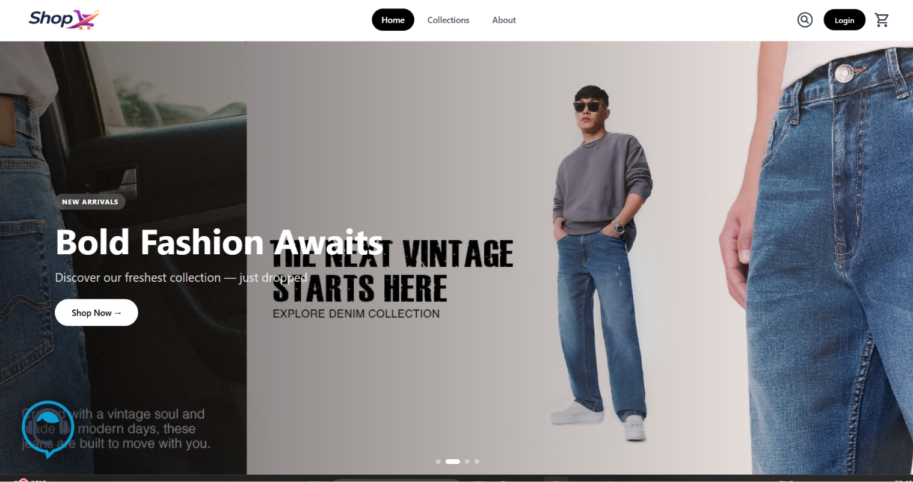
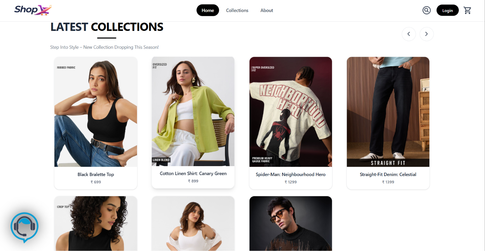
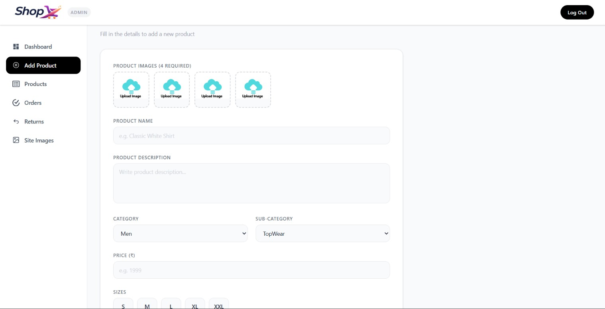

# 🛍️ ShopX — Full-Stack E-Commerce Platform

ShopX is a modern, full-stack e-commerce web application with a customer-facing storefront, a dedicated admin dashboard, and a robust REST API backend. It supports features like Google OAuth, Razorpay payments, Cloudinary image uploads, email notifications, PDF invoices, product reviews, **and a unique AI Voice Navigation assistant**.

---

## 📸 Screenshots

### 🏠 Home Page


### 🛍️ Product Page


### 🛠️ Admin Dashboard


---

## 🏗️ Project Structure

```
shopX-main/
├── backend/        # Node.js + Express REST API
├── frontend/       # React customer storefront (Vite + Tailwind)
└── admin/          # React admin dashboard (Vite + Tailwind)
```

---

## 🚀 Tech Stack

### 🔵 Frontend (Customer App)
| Technology | Purpose |
|---|---|
| **React 19** | UI library |
| **Vite 6** | Build tool & dev server |
| **Tailwind CSS v4** | Utility-first styling |
| **React Router v7** | Client-side routing |
| **Axios** | HTTP requests |
| **React Toastify** | Toast notifications |
| **React Icons** | Icon library |
| **Firebase** | Auth / file storage (optional) |
| **@react-oauth/google** | Google OAuth login |

### 🟠 Admin Dashboard
| Technology | Purpose |
|---|---|
| **React 19** | UI library |
| **Vite 6** | Build tool & dev server |
| **Tailwind CSS v4** | Utility-first styling |
| **React Router v7** | Client-side routing |
| **Axios** | HTTP requests to backend |
| **React Toastify** | Toast notifications |
| **React Icons** | Icon library |

### 🟢 Backend (REST API)
| Technology | Purpose |
|---|---|
| **Node.js** | JavaScript runtime |
| **Express v5** | Web framework |
| **MongoDB + Mongoose** | Database & ODM |
| **JSON Web Token (JWT)** | Authentication tokens |
| **bcryptjs** | Password hashing |
| **Cloudinary** | Cloud image storage |
| **Multer** | File upload middleware |
| **Razorpay** | Payment gateway |
| **Nodemailer** | Email notifications |
| **PDFKit** | PDF invoice generation |
| **Google APIs** | Google OAuth / other integrations |
| **Cookie Parser** | Cookie handling |
| **CORS** | Cross-origin resource sharing |
| **dotenv** | Environment variable management |
| **Nodemon** | Development auto-reload |
| **Validator** | Input validation |

---

## ⚙️ Environment Variables

### Backend — `backend/.env`
```env
PORT=6000
MONGO_URI=your_mongodb_connection_string
JWT_SECRET=your_jwt_secret

CLOUDINARY_CLOUD_NAME=your_cloud_name
CLOUDINARY_API_KEY=your_api_key
CLOUDINARY_API_SECRET=your_api_secret

RAZORPAY_KEY_ID=your_razorpay_key
RAZORPAY_KEY_SECRET=your_razorpay_secret

NODEMAILER_EMAIL=your_email@gmail.com
NODEMAILER_PASS=your_app_password

FRONTEND_URL=http://localhost:5173
ADMIN_URL=http://localhost:5174

CORS_STRICT=false
```

### Frontend — `frontend/.env`
```env
VITE_BACKEND_URL=http://localhost:6000
VITE_GOOGLE_CLIENT_ID=your_google_client_id
```

### Admin — `admin/.env`
```env
VITE_BACKEND_URL=http://localhost:6000
```

> ⚠️ **Never commit `.env` files.** They are already added to `.gitignore` in all three folders.

---

## 🛠️ Installation & Setup

### Prerequisites
- Node.js >= 18
- MongoDB (local or Atlas)
- Cloudinary account
- Razorpay account

### 1️⃣ Clone the Repository
```bash
git clone https://github.com/your-username/shopX.git
cd shopX
```

### 2️⃣ Setup Backend
```bash
cd backend
npm install
# Create .env file and fill in the variables above
npm run dev
```

### 3️⃣ Setup Frontend
```bash
cd ../frontend
npm install
# Create .env file and fill in the variables above
npm run dev
```

### 4️⃣ Setup Admin
```bash
cd ../admin
npm install
# Create .env file and fill in the variables above
npm run dev
```

---

## 🌐 Live URLs

| Service | URL |
|---|---|
| Frontend | https://shop-x-lac.vercel.app |
| Admin | https://shop-x-teal.vercel.app |
| Backend API | https://shopx-6u3e.onrender.com |

---

## 📡 API Endpoints

| Method | Route | Description |
|---|---|---|
| GET | `/` | Health check |
| POST | `/api/auth/*` | Authentication routes |
| GET/POST | `/api/user/*` | User management |
| GET/POST | `/api/product/*` | Product CRUD |
| GET/POST | `/api/cart/*` | Shopping cart |
| GET/POST | `/api/order/*` | Order management |
| GET/POST | `/api/return/*` | Return requests |
| GET/POST | `/api/setting/*` | App settings |
| GET/POST | `/api/review/*` | Product reviews |

---

## ✨ Features

### 🏠 Home Page
- 🎠 **Auto-rotating Hero Slider** — 4 slides with tag, heading & subtitle, auto-advances every 3.5s
- 🔘 Clickable dot navigation to jump between slides
- 🆕 Latest Collection section
- 🏆 Best Sellers section
- 📜 Our Policy section
- 📬 Newsletter subscription box

### 🎙️ AI Voice Navigation
- 🤖 Powered by **Web Speech API** (SpeechRecognition + SpeechSynthesis) — no third-party AI service needed
- 🔵 Fixed floating AI button (bottom-left) with glow animation when active
- 🔊 Plays an activation sound on click
- Supports voice commands:

| Voice Command | Action |
|---|---|
| *"open search"* | Opens search bar & goes to Collections |
| *"close search"* | Closes search bar |
| *"collection"* / *"products"* | Navigates to Collections page |
| *"about"* | Navigates to About page |
| *"home"* | Navigates to Home page |
| *"cart"* | Navigates to Cart |
| *"order"* / *"my orders"* | Navigates to Orders page |
| *Any other phrase* | Treated as a **product search query** |

### 🔐 Auth & Security
- JWT-based authentication with HTTP-only cookies
- Google OAuth login
- Secure CORS configuration

### 🛍️ Shopping
- 🛒 Shopping cart & order management
- 💳 Razorpay payment integration
- 📦 Return request management
- ⭐ Product reviews & ratings

### 🖥️ Media & Comms
- 🖼️ Cloudinary image uploads for products
- 📧 Email notifications via Nodemailer
- 🧾 PDF invoice generation with PDFKit

### 🎨 UI/UX
- 📱 Fully responsive UI
- 🔔 Toast notifications

---

<p align="center">Made with ❤️ by Ritik Varun</p>
